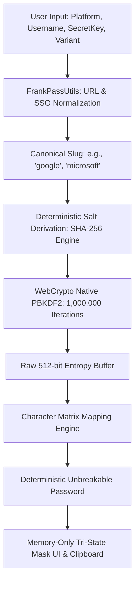
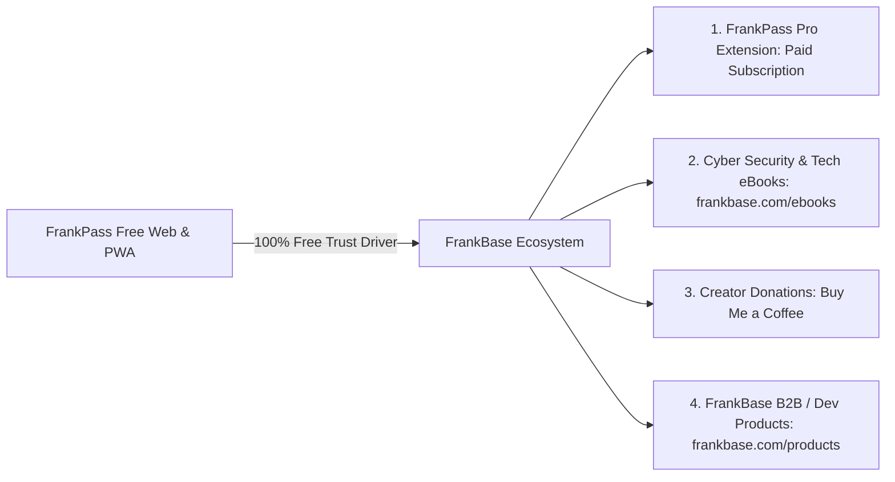

# 🛠️ FrankPass - डेवलपर आर्किटेक्चर, क्रिप्टोग्राफिक ब्लूप्रिंट & फाउंडर सीक्रेट्स
> **दस्तावेज़:** Developer Architecture & Founder Confidential Blueprint  
> **आर्किटेक्ट & फाउंडर:** Master Manikant | **प्रोजेक्ट:** [frankpass.com](https://frankpass.com) / [frankbase.com](https://frankbase.com)  
> **सिद्धांत:** *Stateless Deterministic Cryptography · Zero Cloud · Zero Database · Pure Mathematics*

---

# 📑 PART 1: DEVELOPER & TECHNICAL ARCHITECTURE DEEP-DIVE

## 1. Zero-Knowledge Stateless Architecture Blueprint

पारंपरिक पासवर्ड मैनेजर्स (Stateful Password Managers) में आर्किटेक्चरल विफलता का मुख्य कारण **डेटाबेस (Vault Storage)** होता है। FrankPass एक **Stateless Zero-Knowledge Engine** है, जिसका कोई बैकएंड डेटाबेस नहीं होता।



### मुख्य अंतर: Stateful vs Stateless Architecture
| विशेषता (Feature) | पारंपरिक पासवर्ड मैनेजर (Bitwarden / LastPass) | FrankPass Stateless Math Engine |
| :--- | :--- | :--- |
| **डेटाबेस स्टोरेज** | क्लाउड सर्वर पर एन्क्रिप्टेड वॉल्ट डेटाबेस | **शून्य (Zero Database / Zero Cloud)** |
| **डेटा ब्रीच का जोखिम** | कंपनी का सर्वर हैक होने पर वॉल्ट चोरी का डर | **0% रिस्क (क्योंकि स्टोर करने के लिए कुछ है ही नहीं)** |
| **सर्वर लागत (Cost)** | लाखों यूज़र्स पर भारी डेटाबेस और बैंडविड्थ खर्च | **₹0 / $0 (100% क्लाइंट-साइड ब्राउज़र कंप्यूट)** |
| **ऑफलाइन सपोर्ट** | आंशिक (कैश सिंक की आवश्यकता) | **100% फुल ऑफलाइन (PWA Service Worker)** |

---

## 2. क्रिप्टोग्राफिक इंजन का तकनीकी विनिर्देश (`frankpass-core.js`)

FrankPass पासवर्ड जनरेट करने के लिए W3C Standard **WebCrypto API (`window.crypto.subtle`)** का उपयोग करता है।

### 2.1 Key Derivation Function (KDF):
* **एल्गोरिदम:** `PBKDF2-HMAC-SHA256`
* **इटरेशन काउंट:** `1,000,000` (दस लाख राउंड्स) — OWASP / NIST 2026+ स्टैंडर्ड।
* **हार्डवेयर एक्सेलेरेशन:** ब्राउज़र का C++ नेटिव सब्टल क्रिप्टो इंजन इसे 200ms से 400ms में प्रोसेस करता है।

### 2.2 साल्ट (Salt) निर्माण का गणितीय फॉर्मूला:
```javascript
Salt_String = "Platform=" + CanonicalPlatform + 
              "|User=" + NormalizedUsername + 
              "|Var=" + VariantToken + 
              "|Pepper=" + StaticPepper;

Salt_Buffer = SHA-256(TextEncoder.encode(Salt_String));
```

### 2.3 कैरेक्टर मैट्रिक्स और भ्रांति-रहित सेट (Ambiguity Elimination):
टाइपोग्राफिक भ्रांतियों (`0` vs `O`, `1` vs `l` vs `I`, `c` vs `C`) को दूर करने के लिए FrankPass कैरेक्टर सेट को विशेष रूप से फ़िल्टर करता है:
* **UPPERCASE:** `ABDEFGHJKLMNPQRTUXYZ` (हटाए गए: `I, O, C, S, V, W`)
* **LOWERCASE:** `abdefghijkmnpqrtuxyz` (हटाए गए: `l, o, c, s, v, w`)
* **NUMBERS:** `23456789` (हटाए गए: `0, 1`)
* **SYMBOLS:** `@ # $ % + * =` (यूनिवर्सल सिंबल्स जो सभी वेबसाइट्स पर मान्य हैं)

---

## 3. एसएसओ ब्रांड एलियासिंग & नॉर्मलाइजेशन इंजन (`frankpass-utils.js`)

उपयोगकर्ता द्वारा दर्ज किए गए विभिन्न प्रकार के URLs को एक समान मानक स्लग (Canonical Slug) में बदलने का नियम:

```javascript
// 1. प्रोटोकॉल और सबडोमेन हटाना:
raw = raw.replace(/^(https?:\/\/)?/, '').split('/')[0];
raw = raw.replace(/^(www\.|m\.|app\.|login\.|secure\.|auth\.|account\.)/, '');

// 2. SSO Brand Mapping (सिंगल साइन-ऑन इकोसिस्टम यूनिफिकेशन):
GLOBAL_ALIASES = {
  // Google Ecosystem -> 'google'
  'gmail': 'google', 'googlemail': 'google', 'gdrive': 'google', 'googleaccount': 'google',
  // Microsoft Ecosystem -> 'microsoft'
  'outlook': 'microsoft', 'hotmail': 'microsoft', 'live': 'microsoft', 'office365': 'microsoft',
  // Apple Ecosystem -> 'apple'
  'appleid': 'apple', 'icloud': 'apple',
  // Meta Ecosystem -> 'facebook'
  'fb': 'facebook', 'meta': 'facebook'
};
```

---

## 4. क्लाइंट-साइड AES-GCM लोकल सीक्रेट वॉल्ट (Zero-Plaintext Invariant)

सीक्रेट की को डिवाइस पर सुरक्षित रखने के लिए FrankPass कभी भी प्लेनटेक्स्ट को `localStorage` में नहीं रखता।

```javascript
// 1. 256-bit AES-GCM Device Key Derivation
const deviceKey = await window.crypto.subtle.importKey(
    'raw', keyBuffer, { name: 'AES-GCM' }, false, ['encrypt', 'decrypt']
);

// 2. 12-byte Random IV पर एन्क्रिप्शन:
const iv = window.crypto.getRandomValues(new Uint8Array(12));
const ciphertext = await window.crypto.subtle.encrypt(
    { name: 'AES-GCM', iv: iv }, deviceKey, new TextEncoder().encode(secretKey)
);

// 3. केवल हेक्स स्ट्रिंग स्टोर होती है:
localStorage.setItem('fp_enc_secret', JSON.stringify({ iv: hexIV, data: hexCiphertext }));
```

---

## 5. सर्विस वर्कर और ऑफलाइन PWA इंजन (`service-worker.js v3.2.3`)

* **कैशिंग स्ट्रेटेजी:** `Cache-First with Network Fallback`.
* **इंस्टॉलेशन गारंटी:** कोई भी 404 या टूटी हुई यूआरएल मैनिफेस्ट में नहीं है।
* **नेविगेशन फॉलबैक:** ऑफलाइन होने पर भी सभी रूट सीधे `/index.html` पर लोड होते हैं।

---

# 👑 PART 2: FOUNDER (MASTER MANIKANT) CONFIDENTIAL & STRATEGIC BLUEPRINT

*(यह सेक्शन केवल फाउंडर मास्टर मणिकांत के रणनीतिक मार्गदर्शन और बिजनेस मॉडल की इनर-वर्किंग के लिए है)*

---

## A. क्रिप्टोग्राफिक थ्रेट मॉडलिंग और ब्रूट-फोर्स सुरक्षा (Security Moat)

1. **GPU Brute Force Attack Resistance:**
   - सामान्य MD5 या SHA-256 हैश को आधुनिक RTX 4090 GPU अरबों प्रति सेकंड की दर से क्रैक कर सकता है।
   - लेकिन FrankPass **10 लाख (1,000,000) राउंड्स PBKDF2** इस्तेमाल करता है। 1 पासवर्ड चेक करने में GPU को भारी मेमोरी और समय लगता है। 12-कैरेक्टर के सीक्रेट की को ब्रूट-फोर्स करने में वर्तमान सुपरकंप्यूटर्स को **अरबों साल** लगेंगे ($2^{100+}$ एंट्रॉपी)।

2. **मेमोरी सुरक्षा (In-Memory Isolation):**
   - पासवर्ड केवल रैम (RAM) में अस्थायी तौर पर 1-वेरिएबल में रहता है।
   - जैसे ही यूज़र `Clear Form` दबाता है या टैब बंद करता है, गारबेज कलेक्टर मेमोरी वाइप कर देता है।

---

## B. बिजनेस और मोनेटाइजेशन इकोसिस्टम (4-Tier Revenue Architecture)

FrankPass Web App को **100% फ्री, ऐड-फ्री और बिना ट्रैकिंग** रखा गया है ताकि यह दुनिया भर में **Master Manikant & FrankBase** ब्रांड का सबसे बड़ा **Trust Engine (टॉप-ऑफ-फ़नल)** बने।



### 1. 👑 FrankPass Pro ब्राउज़र एक्सटेंशन (Paid Subscription - Primary Cashflow):
* **प्लेटफॉर्म:** Chrome Web Store, Firefox Add-ons, Edge Add-ons.
* **फीचर्स:** ऑटो-डिटेक्ट वेबसाइट, ऑटो-फिल (1-क्लिक), बायोमेट्रिक फिंगरप्रिंट अनलॉक, मल्टी-प्रोफाइल सिंक।
* **प्राइसिंग मॉडल:**
  - भारत (PPP Pricing): ₹49/माह या ₹499 लाइफटाइम।
  - ग्लोबल: $1.99/माह या $9.99 लाइफटाइम।

### 2. 📖 साइबर सिक्योरिटी और टेक ई-बुक्स (`frankbase.com/ebooks`):
* वेबसाइट पर आने वाले टेक-लवर्स और प्राइवेसी के प्रति जागरूक यूज़र्स सीधे फाउंडर की ऑथर्ड ई-बुक्स खरीद सकते हैं।

### 3. ☕ डायरेक्ट कम्युनिटी सपोर्ट (Buy Me a Coffee Donations):
* ओपन-सोर्स और प्राइवेसी कम्युनिटी से सीधे डोनेशन (`buymeacoffee.com/mastermanikant`)।

### 4. 🚀 FrankBase डेवलपर टूल्स और प्रोडक्ट्स (`frankbase.com/products`):
* FrankPass के माध्यम से यूज़र्स FrankBase के अन्य टूल्स और प्रोडक्ट्स तक पहुंचते हैं।

---

## C. ₹0 सर्वर कॉस्ट स्केलेबिलिटी ब्लूप्रिंट (Zero-Cost Scale Blueprint)

* **100% Static Edge Delivery:** Cloudflare Pages के ग्लोबल एनीकास्ट सीडीएन (300+ डेटा सेंटर्स) पर होस्टेड है।
* **नो बैकएंड लोड:** 1 यूज़र आए या 1 करोड़ (10 Million) यूज़र्स—कंप्यूटेशन उनके खुद के फोन/कंप्यूटर के ब्राउज़र में होती है।
* **फाउंडर को सर्वर का ₹1 भी बिल नहीं देना पड़ता!**

---

## D. भविष्य का रोडमैप (Future Moat & Strategic Horizon)

1. **Deterministic Passkeys / WebAuthn:** भविष्य में पासवर्ड-रहित लॉगिन के लिए FrankPass के गणित से पासकी जनरेट करना।
2. **Official Desktop & Mobile App Store Releases:** Tauri / Rust की मदद से 5MB से कम साइज का अल्ट्रा-लाइट नेटिव ऐप।
3. **Enterprise Zero-Knowledge White-Labeling:** कंपनियों के लिए कस्टम डोमेन और इंटरनल एसएसओ इंटीग्रेशन।

---
*© 2026 Master Manikant · Founder & Chief Architect of FrankPass & FrankBase Ecosystem*
