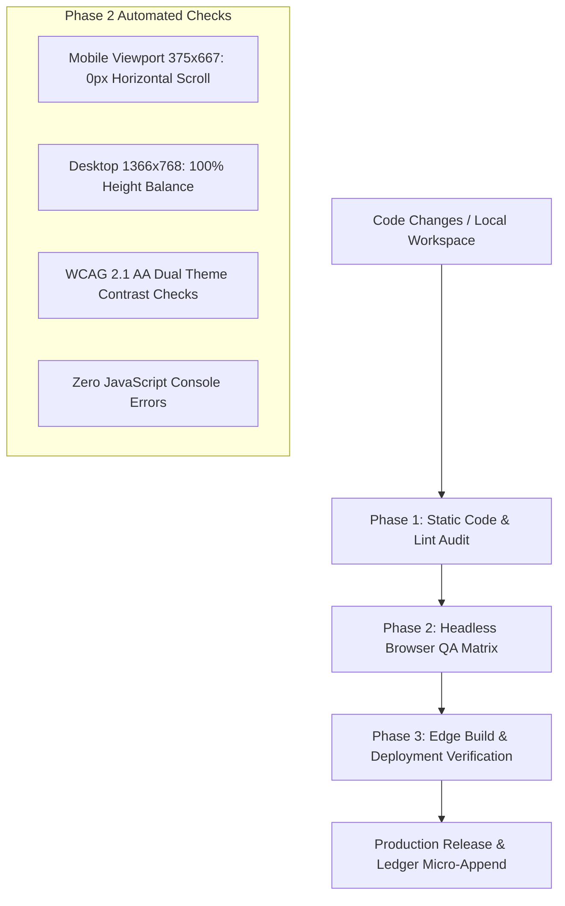

# 🛡️ Universal Web Development Bug Taxonomy & Forensic Audit Guide
> **Comprehensive Architectural Research on Frontend & Backend Vulnerabilities, Edge Cases, and Engineering Failures**
> **Author & Lead Educator:** Master Manikant Yadav | **Ecosystem:** FrankBase / FrankPass Systems Architecture

---

## 📌 Executive Overview & Architectural Scope

In modern web engineering (spanning static edge SPAs, Progressive Web Apps, stateless cryptographic utilities, serverless edge workers, and traditional microservices), software bugs are rarely isolated syntax errors. They stem from **state desynchronization, concurrency race conditions, rendering engine quirks, cache invalidation traps, security vulnerabilities, and network transport failures**.

This document serves as an exhaustive, high-density reference manual categorizing every critical failure mode across the entire web stack.

```
┌─────────────────────────────────────────────────────────────────────────────┐
│                          FULL-STACK BUG TAXONOMY                            │
├──────────────────────────────────────┬──────────────────────────────────────┤
│       1. FRONTEND / CLIENT-SIDE       │        2. BACKEND / SERVER-SIDE      │
├──────────────────────────────────────┼──────────────────────────────────────┤
│ • UI Layout & Viewport Overflow      │ • API Design & Transport Failures    │
│ • DOM Lifecycle & Stacking Context   │ • Auth, Session & Token Leaks        │
│ • State Desync & Memory Leaks        │ • Database Concurrency & Deadlocks   │
│ • Browser Engine & WebKit Quirks     │ • Edge Computing & KV Consistency    │
│ • Client Cryptography & WebCrypto    │ • OWASP Top 10 Security Holes        │
│ • Service Worker & PWA Caching Traps │ • CDN Cache Poisoning & Edge Desync  │
│ • Core Web Vitals & Main-Thread Lag  │ • Silent Failures & Log PII Exposure │
│ • Accessibility (a11y) & Schema SEO  │ • Rate Limiting & Resource Exhaustion│
└──────────────────────────────────────┴──────────────────────────────────────┘
```

---

# PART 1: FRONTEND / CLIENT-SIDE BUG TAXONOMY

---

### 1.1 UI, Viewport & Layout Engine Bugs

| Bug Category | Failure Mechanism | Real-World Impact | Prevention / Fix |
| :--- | :--- | :--- | :--- |
| **Horizontal Scroll Overflow** | Unconstrained fixed-width children (`width: 500px`), unpadded grids (`grid-template-columns: 1fr 1fr` on `<375px`), or absolute radial glows without `overflow: hidden`. | Mobile screen shakes horizontally; right side clips; touch navigation breaks. | Always use `max-width: 100%`, `box-sizing: border-box`, `overflow-wrap: break-word`, and wrap ambient background elements in `overflow: hidden`. |
| **Mobile Viewport Height (`100vh` Trap)** | Using `height: 100vh` on mobile browsers (iOS Safari, Android Chrome). When the browser address bar collapses/expands, `100vh` causes bottom elements to hide behind UI chrome. | CTAs, bottom navigation, and copy buttons get obscured underneath browser bars. | Use modern CSS `min-height: 100dvh` (Dynamic Viewport Height) or calculate `calc(100vh - var(--header-h) - env(safe-area-inset-bottom))`. |
| **Flexbox & Grid Truncation Failure** | Flex children defaulting to `min-width: auto`. A long text string or input field refuses to shrink below its content size, expanding the parent flex container. | Buttons and inputs overflow cards on mobile viewports (e.g., 320px–375px). | Set `min-width: 0` on flex items and use `width: 100%` with `min-width: 0` on inputs. |
| **`z-index` Stacking Context Collisions** | Modals, sticky headers, tooltips, or toasts sharing conflicting stacking contexts created by `opacity < 1`, `transform`, `filter`, or `backdrop-filter`. | Dropdowns render *underneath* generator cards; toasts get trapped behind modals. | Establish explicit z-index tokens (`--z-dropdown: 500`, `--z-header: 1000`, `--z-modal: 2000`, `--z-toast: 3000`) and attach overlays directly to `document.body`. |
| **Collapsing Margins & Layout Shifts** | Uncontained vertical margins on adjacent block elements causing unintended spacing or sudden layout shifts (CLS). | Layout jumps during font loading or dynamic element insertion, hurting SEO. | Use `gap` in Flex/Grid containers rather than vertical block margins; reserve explicit aspect-ratio/dimensions on media. |

---

### 1.2 Day/Night Theme & WCAG Contrast Bugs

| Bug Category | Failure Mechanism | Real-World Impact | Prevention / Fix |
| :--- | :--- | :--- | :--- |
| **Hardcoded Color Leaks** | Hardcoding literal colors (`#0d0e1a`, `rgba(15,17,32,0.9)`, `#fff`) in inline styles or component CSS rather than semantic CSS variables. | When toggling to Light Mode, dark cards remain black, text becomes black-on-black or white-on-white. | Strictly enforce semantic CSS variables (`var(--bg-primary)`, `var(--card-glass-bg)`, `var(--text-primary)`, `var(--border)`) across `:root` and `[data-theme="light"]`. |
| **WCAG 2.1 AA Contrast Failure** | Using muted text (`#64748b` on dark backgrounds) resulting in contrast ratios below 4.5:1 for normal text or 3:1 for large text. | Visually impaired users cannot read password hints, secondary descriptions, or badges. | Use audited palette tokens (e.g., `#cbd5e1` on `#0a0a12` = 11.2:1 contrast in dark mode; `#475569` on `#ffffff` = 7.1:1 in light mode). |
| **Form Control OS Inversion Failure** | Not explicitly declaring background and text color on `<select>`, `<option>`, and `<input>`. On Windows/macOS dark mode, native dropdown menus render unreadable OS default colors. | Country dropdowns or preset pickers show white text on white backgrounds in certain OS environments. | Explicitly define `background: var(--input-bg); color: var(--input-text);` on all `<select>` and `<option>` elements. |

---

### 1.3 DOM Lifecycle, Event & State Management Bugs

| Bug Category | Failure Mechanism | Real-World Impact | Prevention / Fix |
| :--- | :--- | :--- | :--- |
| **Duplicate ID Collisions** | Having duplicate HTML `id` attributes (e.g., `#theme-toggle` or `#copy-btn` appearing in both header and footer/modal). | `document.getElementById()` selects only the first element; secondary buttons fail to respond to clicks; query selectors break. | Ensure IDs are globally unique across all templates; use CSS classes (`.theme-toggle-btn`) for multi-instance elements. |
| **Event Listener Memory Leaks** | Attaching `window.addEventListener('scroll', ...)` or resize listeners inside components without cleaning them up or using `{ passive: true }`. | Mobile browser stutters; scroll jank; memory consumption increases over time. | Use `{ passive: true }` on scroll listeners; throttle with `requestAnimationFrame`; remove listeners on unmount. |
| **Race Conditions in Async UI State** | Firing multiple async generation or autocomplete requests without canceling previous in-flight promises (`AbortController`). | Slow network response overwrites newer input data (e.g., typing "amazon" shows results for "amaz"). | Use `AbortController` to cancel stale fetch requests, or store a monotonically increasing request counter (`requestId`). |
| **State Desynchronization** | Clearing input fields without resetting associated state indicators (e.g., clearing password box but leaving 4-segment strength meter lit up). | UI gives false positive visual feedback; user thinks a password is still active. | Always create atomic reset functions that synchronize data, visual meters, hints, and button disabled states together. |

---

### 1.4 Browser Compatibility & WebKit/Safari Specific Quirks

| Bug Category | Failure Mechanism | Real-World Impact | Prevention / Fix |
| :--- | :--- | :--- | :--- |
| **Transient User Gesture Loss (Clipboard API)** | Running heavy async cryptography (e.g., 1,000,000 PBKDF2 iterations taking ~300ms). WebKit/Safari revokes the user-activation token if too much time passes between user click and `navigator.clipboard.writeText()`. | Password generation completes but auto-copy silently throws `NotAllowedError: Document is not focused / user gesture required`. | Maintain a synchronous fallback using a hidden `<textarea>` with `document.execCommand('copy')` to guarantee auto-copy across iOS Safari and locked webviews. |
| **WebAuthn Credential ID Serialization** | Storing WebAuthn `rawId` as a raw ArrayBuffer or improperly decoded Base64 rather than clean Hex / Uint8Array. | Biometric Face ID / Touch ID works upon registration but fails on subsequent logins (`InvalidAccessError`). | Convert `rawId` to a standard Hex string for `localStorage` persistence, and rehydrate into a `Uint8Array` when building `allowCredentials`. |
| **Backdrop Filter Artifacts** | Applying `backdrop-filter: blur()` to nested elements without `-webkit-backdrop-filter` or on elements with 3D transforms. | Blurry boxes render with sharp square pixel artifacts or black flickers on Safari iOS. | Always declare both `-webkit-backdrop-filter` and `backdrop-filter`; apply `transform: translateZ(0)` to trigger GPU compositing. |

---

### 1.5 Service Worker, PWA & Client-Side Caching Traps

| Bug Category | Failure Mechanism | Real-World Impact | Prevention / Fix |
| :--- | :--- | :--- | :--- |
| **Eternal Stale Cache (The Service Worker Trap)** | Service worker caching `index.html` with a `Cache-First` strategy and no background version check or header control. | Developer pushes critical security fix to GitHub, but all existing users remain permanently stuck on the old version forever. | Serve HTML with `Cache-Control: no-cache, no-store, must-revalidate`; use `Stale-While-Revalidate` for assets; bump cache name (`fp-v3.2.8`) on every release. |
| **Cache Storage Quota Exhaustion** | Unbounded caching of external media, country flags, or audio files into the PWA Cache Storage without LRU eviction. | Browser silently throws `QuotaExceededError`; PWA crashes or stops storing local keys. | Implement LRU (Least Recently Used) cache limiting (e.g., max 50 items); clean up legacy caches in the `activate` event listener. |
| **Unregistered Offline Fallback** | PWA intercepts network requests via `fetch` listener but does not catch network offline errors for uncached URLs. | User in airplane mode sees browser's ugly "No Internet" dinosaur screen instead of offline tool. | Intercept fetch failures in Service Worker and serve pre-cached fallback HTML/shell. |

---

# PART 2: BACKEND / SERVER-SIDE & EDGE BUG TAXONOMY

---

### 2.1 API Design, Serialization & Transport Failures

| Bug Category | Failure Mechanism | Real-World Impact | Prevention / Fix |
| :--- | :--- | :--- | :--- |
| **HTTP 200 Error Anti-Pattern** | Returning HTTP `200 OK` with `{ "success": false, "error": "Unauthorized" }` in the response body. | Monitoring systems (Datadog, Cloudflare) report 100% uptime despite massive systemic API failures; clients fail automated retries. | Strictly adhere to semantic HTTP status codes (`400 Bad Request`, `401 Unauthorized`, `403 Forbidden`, `429 Too Many Requests`, `500 Server Error`). |
| **Floating-Point Currency / Numeric Precision Loss** | Handling monetary amounts or large 64-bit integers as standard IEEE 754 floating-point numbers in JSON. | `0.1 + 0.2 = 0.30000000000000004`; rounding errors compound into actual financial discrepancy; large IDs truncate in JavaScript (`MAX_SAFE_INTEGER`). | Store monetary values in lowest integer units (e.g., cents/paise) or use Decimal libraries; serialize large 64-bit IDs as Strings. |
| **CORS Preflight (`OPTIONS`) Misconfiguration** | Edge server rejecting `OPTIONS` preflight requests or returning `Access-Control-Allow-Origin: *` when `Access-Control-Allow-Credentials: true` is requested. | Client browsers block all cross-domain API calls; console floods with `CORS policy: Response to preflight request doesn't pass access control check`. | Implement explicit preflight handlers returning allowed origins, headers (`Content-Type, Authorization`), and methods (`GET, POST, OPTIONS`). |

---

### 2.2 Concurrency, Database & Data Persistence Bugs

| Bug Category | Failure Mechanism | Real-World Impact | Prevention / Fix |
| :--- | :--- | :--- | :--- |
| **Race Conditions (Double-Spend / Duplicate Records)** | Reading a value, modifying it in application memory, and writing back without database-level transactions or atomic operations. | User clicks "Purchase" or "Register" twice simultaneously; two accounts are created or one balance is deducted twice. | Use atomic database operations (`UPDATE users SET balance = balance - 10 WHERE balance >= 10`), unique constraints, and Redis distributed locks (`Redlock`). |
| **N+1 Query Overhead** | Fetching a list of records in query #1, then executing a separate database query inside a loop for each record's related foreign key data. | Database CPU spikes to 100%; response time degrades from 20ms to 4,000ms under minimal user load. | Use `JOIN` queries, batch resolvers (e.g., DataLoader), or eager loading (`with: ['posts']`) to fetch related data in a single batch query. |
| **Unindexed Table Scans** | Omitting database indexes on frequently filtered/sorted columns (`WHERE email = ?` or `ORDER BY created_at DESC`). | As table grows from 1,000 to 1,000,000 rows, queries switch from O(log N) index lookups to O(N) full table scans, causing database timeouts. | Always add indexes on foreign keys, lookup fields (`email`, `username`, `slug`), and compound filter columns. |
| **Database Connection Pool Exhaustion** | Opening database connections inside request handlers without releasing them back to the pool in `finally` blocks, or setting pool size too small for concurrency. | Server stops accepting new requests with `Error: Connection pool full / Timeout waiting for connection`. | Use connection pooling with health checks; always use connection context managers; ensure pool size matches worker concurrency. |

---

### 2.3 Edge Computing, Serverless & Cloudflare Workers Specific Bugs

| Bug Category | Failure Mechanism | Real-World Impact | Prevention / Fix |
| :--- | :--- | :--- | :--- |
| **CPU Time Limit Exceeded (50ms Cap)** | Running heavy CPU-bound algorithms (cryptographic key derivation, huge regex parsing) inside standard Cloudflare Workers. | Worker execution is forcefully terminated by edge runtime with `Error 1102: Worker exceeded CPU limit`. | Offload heavy cryptographic hashing to client-side WebCrypto, or utilize background Cloudflare Queues / Durable Objects with extended CPU limits. |
| **KV Eventual Consistency Lag** | Writing a key to Cloudflare KV and immediately attempting to read it from a different global edge node. | User updates profile/settings, redirects to dashboard, but sees old cached data because global edge propagation takes up to 60 seconds. | Use Cloudflare D1 / Durable Objects for strongly consistent transactional state; reserve KV strictly for read-heavy, latency-tolerant assets. |
| **Environment Variable & Secret Missing at Edge** | Defining environment variables in local `.env` files but forgetting to bind secrets in Cloudflare Pages / Vercel dashboard. | Production build silently fails or throws `TypeError: Cannot read properties of undefined (reading 'API_SECRET')` during live edge runtime. | Use strict configuration validation schemas (e.g., Zod / Joi) at worker startup that immediately throw informative errors if required keys are missing. |

---

### 2.4 Security & Vulnerability Failures (OWASP Alignment)

| Vulnerability Category | Attack Vector & Mechanism | Defensive Architecture |
| :--- | :--- | :--- |
| **Insecure Direct Object Reference (IDOR)** | Endpoint accepts user ID from request parameters (`GET /api/user/123/invoices`) without verifying if authenticated session owns ID `123`. | Attacker scrapes entire database of customer invoices simply by incrementing integers in URL. Always bind queries to `session.user.id`. |
| **Server-Side Request Forgery (SSRF)** | Backend accepts a URL parameter from user to fetch preview images/metadata without validating destination IP. | Attacker passes `http://169.254.169.254/latest/meta-data/` to dump cloud AWS IAM credentials or query internal VPC services. Whitelist protocols and reject private IP ranges (`10.0.0.0/8`, `127.0.0.0/8`, `192.168.0.0/16`). |
| **Regular Expression Denial of Service (ReDoS)** | Using poorly structured regex patterns with nested quantifiers (`(a+)+$`) against user input strings. | Attacker supplies a specially crafted string causing catastrophic backtracking, locking server CPU at 100% and halting all traffic. Use safe regex linters and linear-time engines (e.g., RE2). |
| **Broken Authentication / Token Leakage** | Storing JWTs or secret keys in unencrypted `localStorage` (vulnerable to XSS) or logging authorization headers in plain text log aggregators. | Compromised third-party npm package steals all session tokens. Use `HttpOnly, Secure, SameSite=Strict` cookies and redact sensitive headers in logger middleware. |

---

# PART 3: UNIVERSAL AUDIT & QUALITY ASSURANCE PROTOCOL

To prevent the bugs categorized above from reaching production, every deployment across the FrankBase/FrankPass ecosystem must pass the **3-Tier Verification Protocol**:



### Pre-Deployment Verification Checklist
1. **Zero Viewport Overflow:** Validate that `document.documentElement.scrollWidth === document.documentElement.clientWidth` on 360px, 375px, 390px, and 412px viewports.
2. **Dual-Theme High Contrast:** Verify that no hardcoded `#rgb` values exist in components and all inputs adapt to Light/Dark modes with `>4.5:1` contrast ratio.
3. **No Duplicate DOM IDs:** Ensure IDs like `#theme-toggle`, `#copy-btn`, and `#menu-btn` are globally unique on every page.
4. **Header Navigation Uniformity:** All subpages must share identical canonical header links.
5. **Zero Localhost Default (Rule 13):** Build artifacts and API endpoints must point directly to live edge domain targets.
6. **PII Privacy Protection (Rule 9):** Ensure founder personal email (`mastermanikant.in@gmail.com`) is never present in any frontend template.

---
*Documentation Frozen & Verified under FrankBase System Specifications.*
